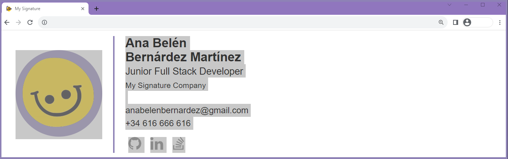
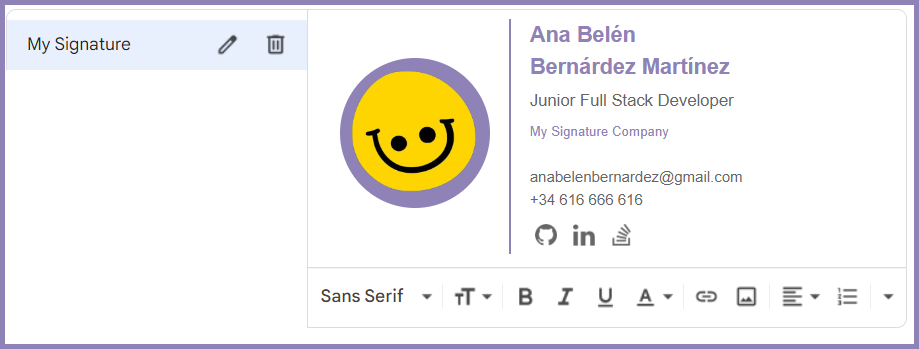

# ✍ My Signature
_A more aesthetically pleasing signature for your e-mails._

## How to:
- You can clone my repository:
```
git clone git@github.com:AnaBelenBernardez/MySignature.git
```
- Alternatively, you can directly edit the HTML file at `index.html`.
- Open the .html file on your browser, you should see something like this:


- Personalize it to your liking.
- Select everything in the browser and copy it.


- Open your e-mail app. I have tested it with Gmail and Outlook (Hotmail), and both worked perfectly.
- Look for the signature options in the settings.
- Paste what you copied, it should look something like this:


- And you are ready to go!

(The signature is synchronized to Gmail as HTML code using Google API, which has a 10,000 character limit.)
